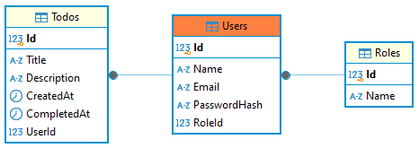

# TodoMinimalApi

## Descrição

**TodoMinimalApi** é uma aplicação minimalista desenvolvida com **.NET 8** e **Entity Framework Core** para gerenciar tarefas (**Todos**). A aplicação suporta operações CRUD para tarefas, autenticação com JWT e está completamente dockerizada, incluindo integração com um banco de dados **PostgreSQL**.

---

## Funcionalidades

- **Autenticação JWT**: Somente usuários autenticados podem acessar endpoints que gerenciam tarefas.
- **CRUD de Tarefas**: Permite criar, listar, atualizar e excluir tarefas.
- **Banco de Dados PostgreSQL**: Persistência de dados usando Entity Framework Core.
- **Usuário Administrador Padrão**: Criado no primeiro uso da aplicação via script de seed ou através do endpoint `/setup`.
- **Swagger UI**: Documentação interativa para testar os endpoints.
- **Dockerização Completa**: Facilita a execução e o deploy.

---

## Tecnologias Utilizadas

- **.NET 8**
- **PostgreSQL**
- **Docker** e **Docker Compose**
- **EF Core** para mapeamento objeto-relacional (ORM)

---

## Pré-requisitos

- [Docker](https://www.docker.com/) instalado.
- [Docker Compose](https://docs.docker.com/compose/) configurado.
- [.NET SDK 8.0](https://dotnet.microsoft.com/pt-br/) (opcional, para execução local fora do contêiner)
- Opcional: [Postman](https://www.postman.com/) ou outro cliente de API para testes.

---

## Como Executar

### 1. Clone o Repositório

- SSH
```bash
git clone git@github.com:ademirsantosjr/todo_minimal_api_dotnet.git
cd todo_minimal_api_dotnet
```
- HTTPS
```bash
git clone https://github.com/ademirsantosjr/todo_minimal_api_dotnet
cd todo_minimal_api_dotnet
```

### 2. Suba os Contêineres

Execute o comando:

```bash
docker-compose up --build
```

Este comando:
- Constrói e sobe os contêineres da aplicação e do banco de dados.
- Aplica as migrations ao banco de dados.
- Cria um usuário administrador padrão:
  - **E-mail**: `admin@todo.com`
  - **Senha**: `admin`

### 3. Acesse a Aplicação

- **Swagger UI**: [`http://localhost:8080/swagger`](http://localhost:8080/swagger)
- **API**: [`http://localhost:8080/api/v1`](http://localhost:8080/api/v1)

### 4. Banco de Dados (Opcional)

Você pode acessar o banco de dados PostgreSQL diretamente usando um cliente SQL:

- **Host**: `localhost`
- **Porta**: `5432`
- **Usuário**: `{ver_docker_compose}`
- **Senha**: `{ver_docker_compose}`
- **Banco de Dados**: `todos`

Ou acessar via Docker:

```bash
docker exec -it todo_postgres psql -U postgres -d TodoDb
```

---

## Endpoints Principais

### **Autenticação**
- `POST /api/v1/auth/login`: Autenticar e obter o token JWT.

### **Registro de novo Usuário**
- `POST /api/v1/auth/register`: Registrar novo usuário.

### **Tarefas (Todos)**
- `POST /api/v1/todos`: Criar uma nova tarefa.
- `GET /api/v1/todos`: Listar todas as tarefas do usuário autenticado.
- `GET /api/v1/todos/{id}`: Obter detalhes de uma tarefa específica.
- `PUT /api/v1/todos/{id}`: Atualizar uma tarefa existente.
- `DELETE /api/v1/todos/{id}`: Excluir uma tarefa existente.

### **Configurações**
- `POST /api/v1/setup`: Caso nenhum usuário administrador tenha sido criado pelo script seed.sql, este endpoint permite a criação do primeiro usuário administrador.

---

## Detalhes Técnicos

### Banco de Dados

A aplicação usa **PostgreSQL** e é gerenciada via **Entity Framework Core**. As tabelas são criadas automaticamente através do script de migrations. Estrutura inicial:

- **Users**:
  - `Id`: Identificador único do usuário.
  - `Name`: Nome do usuário.
  - `Email`: E-mail do usuário.
  - `PasswordHash`: Senha armazenada de forma segura.

- **Roles**:
  - `Id`: Identificador único do papel de usuário.
  - `Name`: Nome do papel de usuário, por exemplo ADMIN.

- **Todos**:
  - `Id`: Identificador único da tarefa.
  - `Title`: Título da tarefa.
  - `Description`: Descrição da tarefa.
  - `CreatedAt`: Data de criação.
  - `CompletedAt`: Data de conclusão (opcional).
  - `UserId`: Identificador do usuário que criou a tarefa.

> ℹ️ Datas de criação e alteração foram mantidas em UTC para preservar a consistência dos dados em seu transporte.

#### Diagrama de Relacionamento



### Usuário Administrador Padrão

Na primeira execução, um usuário administrador é criado automaticamente:

- **E-mail**: `admin@todo.com`
- **Senha**: `admin`

Este usuário pode ser usado para autenticar e testar os endpoints imediatamente. Além disso, o usuário administrador tem permissão para aprovar novos cadastros de usuários comuns.

---

## Customizações

### Alterar o Usuário Administrador Padrão

Para personalizar o e-mail e a senha do administrador, edite o arquivo seed.sql localizado na raiz do projeto (mesmo diretório de docker-compose.yml). Se preferir, remova o arquivo seed.sql e, após subir os contêineres, utilize o recurso `POST /api/v1/setup` informando o nome, e-mail e a senha do usuário administrador.

### Configuração do Banco de Dados

As credenciais e o nome do banco podem ser ajustados no arquivo `docker-compose.override.yml`:

```yaml
environment:
  POSTGRES_USER: postgres
  POSTGRES_PASSWORD: senha
  POSTGRES_DB: db
```
